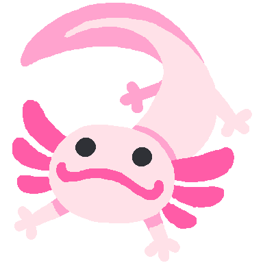

Hi! I'm Spax (he/they). I make things that interest me.  
Accidental frontend dev, aspiring full-stack dev.  
Axolotls are pretty cool 

[website]: https://spax.zone/
[twitter]: https://twitter.com/SpiritAxolotI
[discord]: https://spax.zone/discord
[cohost]: https://cohost.org/Spax
[youtube]: https://www.youtube.com/channel/UC7dPLSdTRPbaYNQJdJM_6rQ

Proficient in:

 

Other things I know of varying amounts

 

 

 

 

Reach me at:

[][website]
[][discord]
[][cohost]
[][twitter]
[][youtube]

Useful links that I enjoy

<https://xyproblem.info>  
<https://nohello.net>  
<https://dontasktoask.com>  
<https://yugoslavia.best>

GitHub stats

 

Other unorganized stuff (in general, about me, and in general about me):

- I was forced to be an apple user for most of my life. trying to switch to linux as soon as possible
- Diagnosed with severe ADHD very young
  - It's excruciatingly hard for me to focus on things that I am disinterested in. On the complete opposite hand, I can get hyperfocused on things that pose as interesting challenges to me.
  - This makes surviving academics a real pain
  - I've tried my hand at medication in the past, but I've found that they just worsen my conditions, so I prefer being unmedicated.
- Self-taught how to use photoshop (with the free online clone called [photopea](https://photopea.com/)) because I wanted to make memes
- I'll PR your stuff if I think you're cool :)
- I am three degrees of separation from Joseph Robinette Biden Jr.
- I consider myself aromantic, so I PROMISE i am not hitting on you
- I've had about three years of programming experience, starting sophomore year of high school (late 2021). I took AP CSP and web dev 1 that year and AP CSA the next year. Now I just program in my free time.
- There are a fair few copypastas that I find funny for no reason. sorry in advance if I share the brainrot
- I'm a fast learner. Good explanations definitely help too.
- I have a small handful of viral youtube videos, the most prolific being [this](https://youtu.be/tvkxupwbFLk) (read the description for more context)
- You can see what sort of music I listen to on my [last.fm](https://last.fm/user/Spaxolotl). I only started using it recently but it's there if you want it
- The red/yellow/blue squiggly line under text is the bane of my existence. Like, shoo, I know what I typed, go away
- Wanting to get into more rhythm games. Currently I only play [OutFox](https://projectoutfox.com/) and [NotITG](https://noti.tg/)
- I put the pro in procrastination (hopefully not for long)
- I'll be photoshop certified soon! Just gotta take the exam and boom, new thing to put on the resumé.
- Politics are a weird subject for me. I'm not very into them, so if you bring it up, I'll talk about it, don't expect much to come out of it.
- When applicable, emoticons > emojis. I don't use kaomoji so that's left up for the reader's interpretation
- Those two things at the top of this readme? The one on the right  is named Nahua, and she's a character I own. The one on the right, Spax, is a representation of me as a person, as a small blue axolotl for some reason. The lore is either dumb or nonexistent right now so I'll revisit it relatively soon (alongside the designs).
- I'd consider myself to have above-average grammar skills, but I've learned that a lot of things don't matter on the internet. As such, I have a small (previously unwritten) system of talking, depending on context:
  - Talking with frequent misspellings, no punctuation, and ignoring case, usually indicates that I'm joking or not taking something seriously
  - Talking as if I'm writing an email to my boss usually indicates that I am being 100% serious.
  - Something in between means that im normal 🧍
- I love talking with people. Shoot me a DM sometime!
  - Sorry if I end up being annoying to you :(. Just tell me and I'll get my act together
- Cilantro doesn't taste like soap to me but it does NOT taste good.
- Yeah I'm a furry (I was doomed from the start ) but I'm only in it for the art. I'm not really interested in fursuiting (yet).
- I will NEVER use UwU and OwO unironically. Kill me on the spot if I do. (On the other hand, :3 is growing on me)
- I'm currently 18 years old. Yay! Taxes, alcohol in England, p~~opc~~orn, and being tried as an adult!
- I currently live in the midwest US
- Aspiring chaos gremlin with restraint
- Vanilla javascript is really cool, but having no javascript and just a completely static website is also really cool. I'm pretty minimalistic for some reason.
- You should hire me! This is the closest thing I have to a resume currently (but keep an eye out for <https://spax.zone/resume>).

Thank you for reading!

 
 
 

  
sorry the brainrot did a thing again

